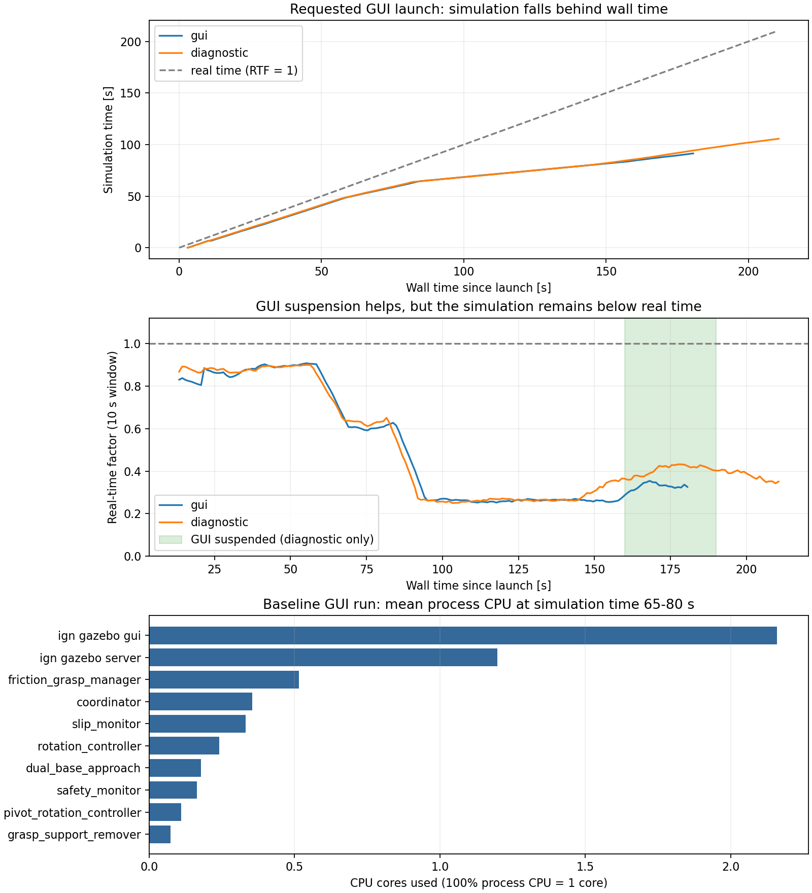

# 協調搬送シミュレーションの負荷解析結果

解析日：2026-09-28（JST）  
対象：`cooperative_transport_bringup / integrated_transport_simulation.launch.py headless:=false`

## 結論

**時間の遅れの主因は、Gazebo / DART の接触・摩擦を含む物理計算です。描画にも負荷がありますが、描画の停止だけでは実時間に追いつきません。**

- 指定コマンドを約 180 秒実行したところ、シミュレーション時間は約 **91.4 秒**でした。
- 把持付近で進行率（RTF）が **0.89 → 0.26** に低下しました。RTF 0.26 は、実時間 1 秒につきシミュレーションが約 0.26 秒進む状態です。
- 物理更新を含む Update パスは、把持後に **約 7.13 ms / ステップ**を消費しました。設定は **2 ms / ステップ**なので、処理時間が予算の約 **3.6 倍**です。
- Gazebo 主スレッドの CPU サンプリングでは、**DART 本体と拘束ソルバが合計 84.4%**を占めました。
- 描画を一時停止しても RTF は **約 0.42**でした。
- Python ノードも無視できない負荷です。ただし、主に **姿勢メッセージの Python オブジェクトへの変換と ROS executor 処理**であり、搬送制御式の計算自体は小さい割合でした。



## 1. 測定条件と方法

実行コマンド：

```bash
cd /home/dars5070/ros2_humble_ws
source /opt/ros/humble/setup.bash
source install/setup.bash
ros2 launch cooperative_transport_bringup integrated_transport_simulation.launch.py headless:=false
```

| 項目 | 条件 |
|---|---|
| CPU | Intel Core i7-14650HX、16 物理コア・24 論理 CPU |
| RAM | 約 31 GiB、遅い区間でも空き相当の available memory は約 24.8 GiB |
| GPU | NVIDIA GeForce RTX 5070 Laptop GPU、VRAM 約 8 GiB |
| シミュレータ | Gazebo Fortress / ignition-gazebo 6.16.0 |
| 物理エンジン | DART 6.12.1（実行中のロード済みライブラリで確認） |
| 使用 world | `cooperative_transport_contact.sdf` |
| 物理設定 | `max_step_size=0.002`、目標 RTF=1.0、設定更新率 500 Hz |
| 描画 | Ogre2、実行時の Ogre ログで NVIDIA GPU 使用を確認 |

測定は次の 3 試行を順番に行いました。

| 試行 | 内容 | 有効な測定期間 |
|---|---|---:|
| gui | 指定された GUI ありの起動。追加の内部プロファイラなし | 約 180.6 秒 |
| headless | GUI なしで起動 | 約 112.4 秒。グリッパ起動／開放失敗のため把持後比較から除外 |
| diagnostic | GUI ありで再現。内部測定を追加し、実時間 160～190 秒付近で GUI プロセスのみ SIGSTOP、続いて SIGCONT | 約 210.6 秒 |

- CPU 使用率：`/proc` を psutil で約 1 秒ごとに取得。**100% は 1 論理 CPU 相当**です。全 CPU の使用率とは分母が異なります。
- RTF：`/clock` の増分を monotonic clock の実時間増分で割って算出。Gazebo world stats も保存しました。
- GPU：`nvidia-smi` を約 1 秒ごとに取得。
- Update パス：診断用の読み取り専用 System プラグインを実行中 world に追加し、最後の PreUpdate から最後の Update までの同一スレッド CPU 時間と実時間を測定。
- ネイティブ CPU サンプル：Gazebo 主スレッドの CPU 時間 10 ms ごとに命令アドレスを記録。4,351 サンプルを `/proc/maps` と公開 ELF 関数シンボルのアドレス・サイズで照合。
- Python：各対象ノードの起動 90 秒後から 20 秒間、`cProfile(timer=time.thread_time)` で主スレッドの CPU 時間を測定。

既存の起動ファイル、モデル、制御コード、システム設定は変更していません。起動時点で存在したユーザーの編集状態をそのまま測定しました。診断用プラグインは今回起動したシミュレーションだけに追加しました。測定用に起動したプロセスは終了済みです。

## 2. どの場面で遅くなるか

GUI ありの通常測定を、シミュレーション時間で区切った結果です。

| シミュレーション時間 | RTF | 全起動子プロセスの平均 CPU 合計 | 解釈 |
|---|---:|---:|---|
| 20～40 秒 | 0.889 | 907% = 約 9.1 コア | 主に準備・接近 |
| 40～55 秒 | 0.739 | 912% = 約 9.1 コア | 閉じ動作・接触が進む区間 |
| 65～80 秒 | **0.263** | 582% = 約 5.8 コア | 把持成立付近から支持台除去前。主スレッドが飽和 |
| 80～90 秒 | 0.305 | 621% = 約 6.2 コア | 支持台除去・搬送開始付近 |

全体の CPU 使用量が減っているのに時間進行が遅くなる点が特徴です。物理計算の主スレッドが律速すると、シミュレーション時間に同期するメッセージ送信や制御周期も実時間あたりでは減ります。

遅い 65～80 秒の区間で、**Gazebo 主スレッドは平均約 96.7%**でした。一方、マシン全体の CPU 使用率は平均約 28.3% です。したがって、24 論理 CPU 全体の不足ではなく、逐次実行される物理更新が主要な制約になっています。

## 3. プロセス別：どれくらい重いか

GUI ありの通常測定、シミュレーション時間 65～80 秒の平均です。内部プロファイラによる CPU 増加を含まない値です。

| プロセス／処理 | 平均 CPU | 主な役割 |
|---|---:|---|
| Gazebo GUI | **216.0%** | 画面描画、Qt/Ogre、描画ワーカースレッド |
| Gazebo server | **119.7%** | 物理更新、センサ、組み込み ROS 制御など。主スレッドだけで約 96.7% |
| friction_grasp_manager | **51.5%** | 指の接触・力・関節状態の受信、把持力の調整 |
| coordinator | **35.4%** | 全姿勢情報の受信、協調搬送指令 |
| slip_monitor | **33.1%** | 全姿勢情報の受信、荷物の滑り監視 |
| rotation_controller | 24.1% | 回転・前進・横移動の制御と入力処理 |
| dual_base_approach | 17.8% | 2 台の接近、把持開始の管理 |
| safety_monitor | 16.4% | 安全状態の監視 |
| pivot_rotation_controller | 11.0% | 指定点回転の待機・制御 |
| grasp_support_remover | 7.4% | 把持確認と支持台の除去 |
| rover_twist_relay × 2 | 合計 13.7% | 速度指令の転送、ROS executor |
| finger_contact_bridge × 2 | 合計 13.3% | 接触メッセージの Gazebo→ROS 変換 |
| finger_ft_bridge × 2 | 合計 6.5% | 指の力センサの Gazebo→ROS 変換 |
| odom_bridge × 2 | 合計 6.2% | オドメトリ／TF の変換 |
| world の clock・pose bridge | 4.7% | `/clock` と全姿勢情報の変換 |
| robot_state_publisher × 2 | 合計 3.8% | ロボット TF の発行 |
| arm_home_positioner | 1.6% | 初期姿勢への移動管理 |

GUI は CPU 使用量の最大項目です。ただし、複数ワーカーに分散した GUI の CPU 合計と、逐次物理更新の所要時間は別の指標です。CPU 合計が大きいことだけでは、シミュレーション時間の律速処理を決められません。

## 4. Gazebo 内部：物理更新と拘束ソルバ

### 4.1 1 ステップの処理時間

診断試行のシミュレーション時間 65～80 秒のうち、計測プラグイン追加後に取得できた 5,686 ステップを集計しました。

| 対象 | CPU 時間 / シミュレーションステップ | 実時間 / ステップ |
|---|---:|---:|
| **Update パス全体** | **7.127 ms** | **7.136 ms** |
| gz_ros2_control PreUpdate、2 台合計 | 約 0.016 ms | — |
| gz_ros2_control PostUpdate、2 台合計 | 約 0.092 ms | — |
| 設定上の時間予算 | **2.000 ms** | **2.000 ms** |

Update パスは、この world の `Physics::Update`、`Sensors::Update` と Gazebo のパス切替処理を含みます。**Physics 関数だけを直接計時した値ではありません。** 内部サンプリングと組み合わせることで、物理計算が大半を占めると判断しました。

CPU 時間と実時間がほぼ一致しているため、この Update パスの遅さは主に計算によるものです。待機や I/O に費やしている時間は小さいと考えられます。

同じ計測で、接触状態が変わる後続区間では平均 CPU 時間が約 4.38～5.27 ms / ステップでした。単発の最大実時間は約 20～25 ms です。負荷は接触状態によって変化し、一定ではありません。

### 4.2 主スレッドの CPU はどこで消費されるか

診断試行の後半、把持・搬送中に取得した 4,351 サンプルです。割合の分母は **Gazebo 主スレッドの CPU サンプル全体**で、マシン全体の CPU 使用率ではありません。

| ライブラリ | CPU サンプル比率 |
|---|---:|
| DART 本体 `libdart.so` | **46.9%** |
| DART の ODE 系 LCP ソルバ `libdart-external-odelcpsolver.so` | **37.4%** |
| libc | 7.3% |
| Gazebo 本体 | 3.1% |
| Gazebo Physics System | 1.7% |
| その他 | 約 3.5% |

代表的な関数の **排他的な命令アドレスの割合**は次のとおりです。親関数を含む呼び出しツリーの累積割合ではありません。

| 処理 | CPU サンプル比率 | 内容 |
|---|---:|---|
| `_dDot` | **13.9%** | 拘束ソルバ内の内積計算 |
| `_dSolveL1` | **8.1%** | ソルバ内の三角行列求解 |
| `BoxedLcpConstraintSolver::solveConstrainedGroup` | **8.0%** | 接触・摩擦などの拘束群を解く処理 |
| `ConstrainedGroup::getConstraint` | **6.1%** | 拘束群の参照処理 |
| `_dSolveL1T` | **5.6%** | ソルバ内の転置三角行列求解 |
| `BodyNode::getArticulatedInertia` | 4.1% | 多関節剛体の慣性処理 |
| `dSolveLCP` | **3.9%** | LCP の求解 |

**「物体を画面に描く処理」以上に、接触した多関節ロボットと荷物の拘束を解く処理が時間進行を制限しています。** 衝突形状の探索だけでなく、接触後の拘束行列・摩擦の求解が重いことを示す結果です。

なお、公開関数シンボルの範囲に収まらないサンプルは未分類としました。関数別の表は物理計算全体を網羅するものではありません。

## 5. 描画の影響

GUI ありの通常試行での GPU 測定値：

| 項目 | 値 |
|---|---:|
| GPU 使用率、測定全体平均 | 約 15.6% |
| GPU 使用率、最大 | 25% |
| VRAM 使用量、最大 | 約 239 MiB |
| GUI の平均 CPU、遅い区間 | 約 2.16 コア |

Ogre ログは NVIDIA を実際に使用していました。シェル単体の `glxinfo` が Intel を示しても、今回の launch は PRIME の環境変数を設定するため、Gazebo の描画 GPU は NVIDIA でした。

診断試行で、同じ world を動かしたまま GUI プロセスの全スレッドを一時停止した結果：

| 比較区間、起動後の実時間 | RTF | GUI CPU | server CPU |
|---|---:|---:|---:|
| 停止前、140～160 秒 | 0.339 | 205.8% | 123.6% |
| 停止中、162～190 秒 | **0.418** | **0%** | 126.9% |
| 再開後、192～210 秒 | 0.361 | 209.7% | 123.7% |

描画停止は CPU 資源の節約と進行率の改善に寄与しました。ただし、区間中にロボットの移動・接触状態も変わるため、この差をそのまま「描画だけによる改善率」とは断定できません。確実に言えるのは、**GUI を止めても RTF は 1.0 に届かず、物理計算側の制限が残った**ことです。

GPU 使用率にも余裕があります。ただし、この測定では描画フレーム単位の CPU/GPU 時間や FPS は取得していません。GPU 使用率だけで描画待ちの有無を完全には判定できません。

## 6. Python 制御ノードの内部負荷

各ノードを 20 秒間プロファイルした結果です。割合は、そのノードのプロファイルされた **主スレッド CPU 時間**に対するものです。cProfile 自体が負荷を増やすため、通常実行のプロセス CPU 使用率へそのまま換算しないでください。

| ノード | 主な処理 | 主スレッド CPU 時間に対する割合 |
|---|---|---:|
| coordinator | `_take_subscription`：受信メッセージの変換・取り出し | **93.6%** |
| coordinator | 実際の `_control_tick` | **0.4%** |
| slip_monitor | `_take_subscription` | **93.8%** |
| slip_monitor | 実際の `_tick` | **0.2%** |
| rotation_controller | `_wait_for_ready_callbacks`：executor の待機集合準備など | **74.4%** |
| rotation_controller | `_take_subscription` | 16.7% |
| rotation_controller | 実際の `_control_loop` | **0.7%** |
| friction_grasp_manager | `_take_subscription` | **43.4%** |
| friction_grasp_manager | `_wait_for_ready_callbacks` | **32.1%** |
| friction_grasp_manager | 接触コールバック `_on_contact` | 4.2% |
| friction_grasp_manager | 指力コールバック `_on_finger_wrench` | 2.0% |
| friction_grasp_manager | 状態更新 `_tick` | 0.2% |

これらは呼び出し先を含む累積時間です。行同士で重複する可能性があるため、合算しないでください。

`coordinator` と `slip_monitor` は、ともに `/world/cooperative_transport_friction/pose/info` の **全姿勢を含む TFMessage** を購読しています。20 秒の計測で、それぞれ約 700 回の姿勢コールバックと約 **17.2 万回の Transform オブジェクト生成**が発生しました。1 姿勢メッセージあたり約 245 個の Transform 生成に相当します。

`Transform.__init__` の累積時間だけでも主スレッド CPU 時間の約 34～35% でした。必要な荷物・ロボット姿勢を探す前に、メッセージ内の大量の姿勢を Python オブジェクトに変換する費用が発生しています。制御数式の最適化よりも、入力メッセージの量・対象・頻度を減らす方が有効な候補です。

## 7. 実際に動作するモデルの複雑さ

起動と同じ引数で xacro を展開し、Gazebo が使用する SDF に変換して数えました。

| 項目 | 1 台 | 2 台合計 |
|---|---:|---:|
| 物理リンク | 16 | 32 |
| ジョイント | 15 | 30 |
| 衝突形状 | **38** | **76** |
| うち mesh 衝突形状 | 11 | 22 |
| 指の contact センサ | **18** | **36** |
| 指の force_torque センサ | 2 | 4 |

これに荷物、床、支持台の衝突形状が加わります。

- 左右の指はそれぞれ 9 個の box に分割され、それぞれに contact センサがあります。
- contact センサは設定上 30 Hz、指の force_torque センサは 100 Hz。
- 組み込み controller manager は 250 Hz、オドメトリは 50 Hz。
- 制御ノードは主に 30～50 Hz、把持管理のタイマは 10 Hz。
- カメラと LiDAR はこの launch では無効です。手首 F/T も既定では無効です。
- `contact_only=true` のため、独自の `FrictionGripSystem` プラグインはこの試行で動作していません。

センサ出力周期と物理接触の求解周期は別です。contact センサを 30 Hz から下げても、物理エンジンが 2 ms ごとに接触を解く費用がそのまま減るとは限りません。

## 8. 改善候補と優先順位

今回の依頼は調査のため、以下の変更は実施していません。効果は再測定が必要です。

| 優先 | 対象 | 具体的な候補 | 今回の根拠・検証条件 |
|---|---|---|---|
| 1 | 接触・摩擦拘束 | 指や非把持部分の衝突形状・不要な接触を整理。必要な把持面を保って拘束数を減らす | LCP・DART が主負荷。把持力、荷物の滑り、台車姿勢を維持できることを確認 |
| 2 | 全姿勢メッセージ | C++ 側などで荷物・必要ロボット姿勢だけに絞って ROS へ配信。必要な監視頻度へ調整 | coordinator/slip_monitor はメッセージ取り出し・変換に約 94% |
| 3 | 接触通知・executor | 36 系統の接触通知を必要な意味単位に集約し、ROS コールバック量を減らす | 把持管理の受信・executor が高負荷。接触判定の欠落を避ける |
| 4 | GUI | GUI なし、影の低減、描画頻度の調整を検証 | 約 2 コア分を消費。時間進行改善は補助的 |
| 5 | 物理刻み・ソルバ設定 | 物理ステップ拡大やソルバ設定変更を別条件で比較 | 2 ms 予算に対して約 7 ms。接触安定性と把持力精度への影響を評価 |

物理ステップを大きくすると更新回数は減りますが、接触・摩擦・把持制御の挙動が変わります。`real_time_factor` の目標だけを上げても、必要な計算量は減りません。

また、launch の `TimerAction` は起動後の実時間で進み、各ノードの `use_sim_time` による制御はシミュレーション時間で進みます。RTF が低いと「起動から 28 秒で荷物を出す」といった起動順序とロボットの実際の準備状況のずれが大きくなります。これは主負荷とは別ですが、準備完了イベントでの起動へ置き換えると起動の再現性改善が期待できます。

## 9. 解析の限界

- 通常試行は把持・搬送開始までを測定しました。前進、30 度回転、横移動、指定点回転の全工程は完走していません。工程ごとの最大負荷や完走時の総遅延は未測定です。
- headless 試行は `amir2 gripper did not reach safe-open position` で接近が中止されました。headless の RTF 約 0.9 と、GUI ありの把持後 RTF 約 0.26 を直接比較することはできません。
- GUI 停止前後は同一試行ですが、物理状態が時間とともに変わります。描画単独の効果量は厳密には分離できていません。
- cProfile は Python の負荷を増加させます。プロセス別 CPU 表は内部計測なしの通常試行から取得し、内部処理の割合とは分けて記載しました。
- Native サンプルは後半の主スレッドだけを対象とし、全スレッドのプロファイルではありません。ライブラリ／関数比率を全マシンの比率と解釈しないでください。
- Update パスは Physics 単体の直接計時ではありません。物理内部の関数別時間はサンプリング推定です。接触点数・拘束行列サイズそのものは取得していません。
- perf は `perf_event_paranoid=4` で利用できず、gdb の attach も環境で拒否されました。システム設定は変更せず、プロセス内の診断プラグインで計測しました。
- Chrome、VS Code、デスクトップなどが動作している通常の利用環境で測定しています。各条件は 1 回ずつで、統計的な繰り返し試験は行っていません。
- 測定終了時に SIGINT で停止したため、ログ末尾にはノードの終了エラーや KeyboardInterrupt が含まれます。起動中の機能エラーとは区別してください。

## 10. データと再集計

すべて [simulation_performance/20260928](simulation_performance/20260928/) に保存しました。

| ファイル | 内容 |
|---|---|
| [summary.json](simulation_performance/20260928/summary.json) | 区間別 RTF・プロセス CPU 集計 |
| [gui/samples.jsonl](simulation_performance/20260928/gui/samples.jsonl) | 通常試行の CPU・スレッド・シミュレーション時間 |
| [gui/launch.log](simulation_performance/20260928/gui/launch.log) | 通常試行の起動・状態遷移ログ |
| [gui/gpu.csv](simulation_performance/20260928/gui/gpu.csv) | GPU 負荷 |
| [gui/ogre2.log](simulation_performance/20260928/gui/ogre2.log) | 実際の描画 GPU の確認 |
| [diagnostic/native/update_pass.csv](simulation_performance/20260928/diagnostic/native/update_pass.csv) | Update パスの CPU・実時間 |
| [diagnostic/native/pc_summary.json](simulation_performance/20260928/diagnostic/native/pc_summary.json) | ネイティブ CPU サンプルのライブラリ・関数別集計 |
| [diagnostic/python/summary.json](simulation_performance/20260928/diagnostic/python/summary.json) | Python 関数別集計 |
| [model_inventory.json](simulation_performance/20260928/model_inventory.json) | 展開後モデルの構成 |
| [measure.py](simulation_performance/20260928/measure.py) | 起動・計測・終了用スクリプト |
| [profiling_support](simulation_performance/20260928/profiling_support/) | 診断プラグインと Python 計測コード |

通常条件を再測定する場合：

```bash
source /opt/ros/humble/setup.bash
source install/setup.bash
/usr/bin/python3 simulation_performance/20260928/measure.py \
  simulation_performance/20260928/gui_repeat 180 false
```

保存データから再集計・グラフ生成する場合：

```bash
/usr/bin/python3 simulation_performance/20260928/analyze.py
/usr/bin/python3 simulation_performance/20260928/summarize_profiles.py
PYTHONNOUSERSITE=1 /usr/bin/python3 simulation_performance/20260928/plot_results.py
```

グラフ生成だけ `PYTHONNOUSERSITE=1` としているのは、この環境でユーザー領域の NumPy とシステム matplotlib に互換性問題があったためです。ROS 環境のパッケージは変更していません。
