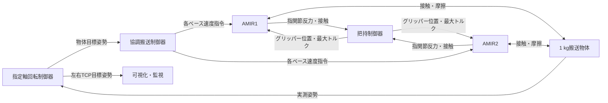
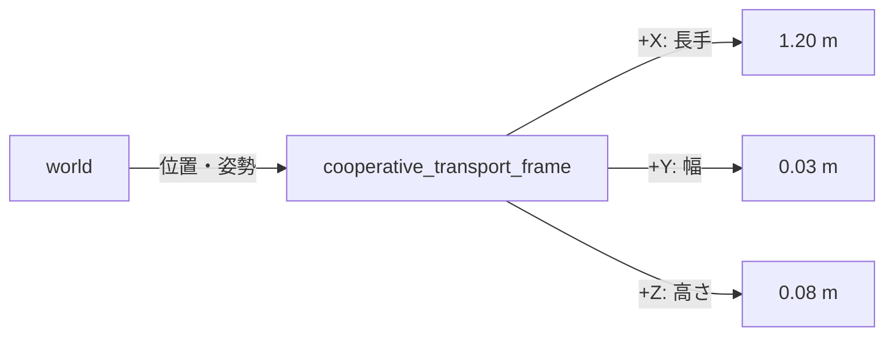

# AMIR協調搬送シミュレーションの物理モデルと制御アルゴリズム

更新日: 2026-09-09  
対象: `friction_rotation_simulation.launch.py` で起動する、2台のAMIRによる接触把持・指定軸回転搬送

## 1. この資料の範囲

この資料は、現在のワークスペースに実装されている次の内容を、コード、URDF/Xacro、SDF、設定値に基づいて整理したものである。

1. グリッパーと接触の物理モデル
2. グリッパーの制御アルゴリズム
3. 搬送物体の物理モデル
4. 協調搬送の物理・運動学モデル
5. 協調搬送および指定軸回転の制御アルゴリズム
6. 安全監視、計測値の意味、現在の近似と制約

ここでいう「物理モデル」には2種類ある。

- Gazeboの物理モデル: 質量、慣性、衝突、摩擦、接触ばね・減衰、重力を含む剛体シミュレーション
- 制御器内部のモデル: 物体と2台の移動ベースを平面剛体として近似した運動学モデル

両者は同一ではない。指の弾性、接触点の切替、車輪すべりなどはGazeboでは発生するが、協調制御器の式には陽には含まれない。

## 2. システム全体構成



現在の接触搬送では、物体をグリッパーへ固定するジョイント、姿勢拘束、物体へ直接加える補助力は使用しない。物体を保持・搬送する力は、指と物体の衝突接触および摩擦だけから発生する。

### 2.1 物体姿勢の取得と搬送座標系

シミュレーションでは、Gazeboが配信する `/world/cooperative_transport_friction/pose/info` の物体モデル姿勢から、`cooperative_payload` の位置とクォータニオン姿勢を取得する。これは物理エンジン内の**真値**であり、カメラ画像から推定した値ではない。

取得値は、次の2つのROSインターフェースへ同時に出力する。

| 出力 | 型 | 意味 |
|---|---|---|
| `/cooperative_transport/measured_payload_pose` | `geometry_msgs/PoseStamped` | `world` 座標系での物体位置・姿勢 |
| `world -> cooperative_transport_frame` | `/tf` の `geometry_msgs/TransformStamped` | 物体に固定された搬送座標系 |

`cooperative_transport_frame` は搬送物体のモデル原点に置く。このモデルではモデル原点、リンク原点、重心が一致するため、原点は物体重心である。軸は物体のSDF形状に合わせた右手系で、`+X` を長手方向（1.20 m）、`+Y` を幅方向（0.03 m）、`+Z` を高さ方向（0.08 m、初期状態では上向き）とする。物体が回転すると、この座標系も物体と一体で回転する。



実行中は次で確認できる。

```bash
ros2 topic echo --once /cooperative_transport/measured_payload_pose
ros2 run tf2_ros tf2_echo world cooperative_transport_frame
```

実機へ移行する際は、カメラ、マーカ、あるいは外部トラッカーによる物体姿勢推定ノードが、同じ `PoseStamped` と `world -> cooperative_transport_frame` を出力する構成に置き換える。このため、上位の回転搬送制御器は計測器の違いから切り離せる。

## 3. 搬送物体の物理モデル

### 3.1 形状、質量、慣性

搬送物体は単一の直方体剛体である。

| 項目 | 値 |
|---|---:|
| 寸法 | 1.20 × 0.03 × 0.08 m |
| 質量 | 1.0 kg |
| 重心 | リンク原点 |
| `Ixx` | 0.000608 kg·m² |
| `Iyy` | 0.120534 kg·m² |
| `Izz` | 0.120075 kg·m² |
| 交差慣性 | 0 |

慣性値は一様密度の直方体に相当する値として設定されている。視覚形状と衝突形状は同じ寸法である。

### 3.2 接触パラメータ

| 項目 | 値 |
|---|---:|
| 摩擦係数 `mu`, `mu2` | 10.0, 10.0 |
| 接触剛性 `kp` | 100000 N/m相当 |
| 接触減衰 `kd` | 50 N·s/m相当 |
| 接触補正最大速度 `max_vel` | 0.01 m/s |
| 最小侵入深さ `min_depth` | 0.0001 m |

Gazeboの接触は完全剛体拘束ではなく、微小な侵入量に応じて反力を発生するペナルティ型接触として扱われる。そのため、表示上のわずかなめり込み、接触点の切替、瞬間的な反力変動が発生し得る。

### 3.3 重力と支持台

世界の重力は `g = 9.81 m/s²` である。把持成立前は静的な支持台が物体を支え、両ロボットが `HOLDING` になった0.5秒後に支持台を削除する。削除後は1 kgの物体重量約9.81 Nを、4つの指接触とアーム・ベースが支持する。

## 4. グリッパーの物理モデル

### 4.1 機構

AMIRのグリッパーは1つの駆動関節 `Gripper` と複数のmimic関節で構成される。左右のリンクが同一指令角度に連動して開閉する。

| 項目 | 値 |
|---|---:|
| 関節範囲 | -1.047198 ～ 0.261799 rad |
| シミュレーション初期角度 | -1.0 rad（開状態） |
| URDF上の努力上限 | 1.4 N·m |
| 現在の制御指令上限 | 1.3 N·m |
| 速度上限 | 2 rad/s |
| mimic関節の減衰 | 0.1 N·m·s/rad |
| mimic関節の摩擦 | 0.05 N·m |

角度が増加する方向が閉方向である。

### 4.2 指形状

左右の指先は、元のSTL輪郭を9個の直方体で近似している。各直方体についてvisualとcollisionを同じ位置・寸法にしており、見た目と物理接触面を一致させている。左右は鏡像で、指リンク1個の質量は0.022898 kgである。

単純形状を複数使用する理由は、複雑な三角形メッシュ衝突よりGazeboの接触解法が安定しやすく、元の指外観にも近づけられるためである。一方、接触が隣接する直方体へ移る瞬間には、接触点や関節反力が切り替わることがある。

### 4.3 摩擦と接触

指先と物体の把持面は `mu = mu2 = 10.0`、`kp = 1e5`、`kd = 50` である。内外リンクの摩擦係数は2.0、グリッパーベースとアームリンクは1.4である。

クーロン摩擦の単純化では、1接触点の接線方向力はおおむね次を満たす。

```text
|F_t| <= μ F_n
```

ただしGazeboでは複数接触点、接触剛性、時間離散化を含めて解かれるため、この式だけで瞬間反力を一意に決めることはできない。

### 4.4 センサー

- 接触センサー: 左右それぞれ9個のcollisionを30 Hzで監視
- 指力センサー: `left_inner_front_joint` と `right_inner_front_joint` の6軸関節反力を100 Hzで出力
- 手首力センサー: `Joint_5` の6軸反力を100 Hzで出力

把持制御に使う法線力は、指関節センサー座標系のX成分の絶対値である。

```text
F_n = |F_x|
```

この値は接触面だけの純粋な法線力ではなく、指リンクの慣性、物体から伝わる接線反力、関節を通る動的反力を含む「伝達反力」である。この点が実機の指先ロードセルとの主な違いである。

## 5. グリッパーの制御アルゴリズム

### 5.1 状態遷移

```text
WAITING_FOR_CONTROLLERS
  -> OPENING_GRIPPERS
  -> READY_TO_GRASP
  -> CLOSING_GRIPPERS
  -> LIFTING
  -> HOLDING
  -> LOWERING / OPENING_FOR_RELEASE / RELEASED
```

接触不成立、把持喪失、アクション拒否の場合は対応する `ERROR_*` 状態へ遷移する。

### 5.2 力の前処理

各指の生法線力に指数移動平均を適用する。

```text
F_f[k] = α F_n[k] + (1 - α) F_f[k-1]
α = 0.25
```

制御周期は0.10秒である。接触センサーでは、相手collision名に `cooperative_payload` が含まれることも確認する。

### 5.3 接触探索と目標力制御

接触前はグリッパー角度を1周期あたり0.008 radずつ閉じる。両指接触後は、目標17 Nに対する位置補正型の力制御を行う。

```text
e_F = F_target - (F_left + F_right) / 2
Δq = clamp(K_F e_F, -Δq_max, Δq_max)
q_cmd = clamp(q_current + Δq, q_open, q_close)
```

| パラメータ | 値 |
|---|---:|
| `F_target` | 17 N/指 |
| 許容差 | ±3 N |
| `K_F` | 0.00025 rad/N |
| `Δq_max` | 0.004 rad/周期 |
| 接触探索ステップ | 0.008 rad/周期 |
| 最大法線力判定 | 20 N |
| 最大駆動努力 | 1.3 N·m |

どちらか一方が `F_target + 許容差` を超えた場合は、反対側が弱くても開方向へ補正する。これは片側だけを過大圧縮しないための保護である。

### 5.4 把持成立条件

閉動作開始から3秒以降、次を0.30秒連続で満たすと持上げへ進む。

- 左右両指の物体接触が確認できる
- 4指すべての平滑法線力が17±3 Nに入る
- グリッパー角度と左右ロボット間の角度差が許容範囲内

持上げでは両アームのJoint 2を+0.10 rad、Joint 3を-0.10 rad動かす。持上げ後にも接触を確認し、把持直後0.5秒の平均反力をExcel用バイアスとして記録して `HOLDING` へ移る。

### 5.5 搬送中の把持維持

`HOLDING` 中は、回転慣性などで測定反力が20 Nを一時的に超えても指を開かない。通常は成立時の指令位置を保持する。

どちらかの平滑法線力が8 N未満になった場合だけ、次式で閉方向へ回復する。

```text
Δq = clamp(K_F (F_target - min(F_left, F_right)), 0, Δq_max)
```

0.30秒以上接触条件を失うと把持喪失エラーにする。この設計は、搬送反力を過大把持と誤認して開閉を繰り返す現象を避け、物体保持を優先するものである。

## 6. 協調搬送の物理・運動学モデル

### 6.1 Gazebo側

Gazeboでは、2台のAMIR、各アーム、指、物体をそれぞれ質量・慣性を持つ剛体リンクとして解く。物体と指は接触・摩擦のみで結合される。世界の物理刻みは2 ms、目標更新レートは500 Hzである。

車輪、床、関節、指接触を含むため、実際の応答には次が含まれる。

- メカナム車輪の摩擦とすべり
- アーム・指リンクの慣性
- 接触面の微小侵入と減衰
- 4指間の内力と荷重再配分
- 指令と実姿勢の追従遅れ

### 6.2 制御器側の平面剛体近似

協調制御器は、ロボット1と2のベース中心姿勢を `p1=(x1,y1,ψ1)`、`p2=(x2,y2,ψ2)` とし、搬送物体の推定中心と向きを次で求める。

```text
p_c = (p1 + p2) / 2
ψ_c = atan2(y2 - y1, x2 - x1)
```

ロボット1からロボット2へのベクトルを物体の+X方向とみなす。これは物体、両TCP、両ベースが理想的な剛体隊形を保つという近似であり、接触部の微小すべりや弾性は直接モデル化しない。

### 6.3 剛体運動の速度分配

物体中心の並進速度を `v_c`、角速度を `ω`、中心から各ロボットへの位置を `r_i` とすると、各ロボットの世界座標速度は次になる。

```text
v_i = v_c + ω × r_i

v_ix = v_cx - ω r_iy
v_iy = v_cy + ω r_ix
```

これを各ロボットのyawでローカル座標へ変換し、メカナムベース速度指令として送る。

## 7. 協調搬送の制御アルゴリズム

### 7.1 物体レベルの比例制御

目標物体姿勢 `p_d=(x_d,y_d,ψ_d)` に対して、並進速度と角速度を比例制御で求める。

```text
v_c = K_p (p_d - p_feedback)
ω = clamp(K_ψ normalize(ψ_d - ψ_c), ω_max)
```

現在の主要値は次のとおりである。

| 項目 | 値 |
|---|---:|
| 制御周期 | 50 Hz |
| 位置ゲイン | 0.35 s⁻¹ |
| yawゲイン | 0.50 s⁻¹ |
| ベース向き補正ゲイン | 0.20 s⁻¹ |
| 回転搬送時の最大並進速度 | 0.060 m/s |
| 最大角速度 | 0.040 rad/s |
| 回転搬送時の最大並進加速度 | 0.025 m/s² |
| 最大角加速度 | 0.060 rad/s² |
| 位置許容差 | 0.02 m |
| 回転搬送時yaw許容差 | 0.5° |

速度は大きさを保って飽和させ、前回指令からの変化は加速度上限で制限する。ロボット2は物体反対側を向くため、目標向きにπを加えて各ベース姿勢を補正する。

### 7.2 使用するフィードバック

通常の回転搬送では、物体中心位置についてはGazeboから得た実測物体位置を使用し、yaw制御は2台のベース中心で定義した隊形yawを使用する。実測物体yawをそのままベース制御へ戻すと、向かい合う摩擦把持により実効的な符号が反転する場合があるためである。

### 7.3 アドミッタンス制御

横方向内力を逃がすための1軸アドミッタンス制御も実装されている。

```text
M x_ddot + D x_dot + K x = F_internal
```

設定値は `M=3.0`、`D=26.8`、`K=60.0`、不感帯3 N、変位上限0.012 m、速度上限0.004 m/sである。ただし、現在の通常回転搬送では無効であり、障害物スラローム評価時にだけ有効化する。

## 8. 指定軸回転制御

### 8.1 目標姿勢生成

回転開始時に物体初期姿勢 `T_W_O(0)` と、物体から各TCPへの相対変換 `T_O_Gi` を保存する。指定した世界座標軸回りの回転 `R_axis(θ)` から物体目標姿勢を生成し、各TCP目標を次で求める。

```text
T_W_O(θ) = RotateAboutAxis(T_W_O(0), axis_point, axis, θ)
T_W_Gi(θ) = T_W_O(θ) T_O_Gi
```

現在のベース指令系が対応する回転軸は世界Z軸である。既定では軸通過点を物体中心に設定する。

### 8.2 角度軌道

角度指令は加速、定速、減速からなる台形軌道である。短距離では定速区間のない三角軌道になる。

```text
加速区間: θ(t) = 0.5 α t²
定速区間: θ(t) = θ_ramp + ω_max (t - t_ramp)
減速区間: 残距離 = 0.5 α (T - t)²
```

現在値は最大角速度2°/s、角加速度0.25°/s²であり、2°/sまで8秒かけて立ち上げる。

### 8.3 回転開始前の安定化条件

両把持状態と支持台撤去に加え、回転前に次を確認する。

- 4指すべての法線力データが新しい
- 4指すべてが8 N以上
- 各指の直近2秒間の最大値－最小値が2 N以内
- 4指の最新平均値が17±5 N
- 条件成立後、さらに自動開始待機2秒

平均値の許容幅を広くしているのは、指関節反力に把持プリロード以外の定常成分も含まれるためである。厳密な安定判定は各指の2秒間変動幅で行う。

### 8.4 追従誤差ガバナ

物体が目標姿勢に追従できない場合、目標軌道時間だけを停止する。

```text
姿勢誤差 >= 2° : 軌道進行を一時停止
姿勢誤差 <= 1° : 軌道進行を再開
```

2つの閾値によるヒステリシスで、境界付近の高速な停止・再開を防ぐ。物体目標の更新は停止しても、協調搬送制御は現在目標への追従を続ける。

### 8.5 終端補正

軌道が目標角度へ到達した後は `SETTLING` へ移る。摩擦接触のねじれによる残留誤差を除くため、実角度誤差の2倍を最大4°まで搬送目標へ上乗せする。実物体が目標1°以内かつ位置誤差0.02 m以内で2秒間安定すると完了する。

## 9. 安全監視

主な停止・異常判定は次のとおりである。

- 両ロボットの把持状態喪失
- 支持台が残った状態での回転
- オドメトリまたは物体姿勢のタイムアウト
- 物体追従位置誤差0.10 m超過
- 物体追従姿勢誤差15°超過
- ロボット間距離2.30～3.10 mの範囲外
- ベース速度0.12 m/s超過
- 物体の水平、垂直、yawすべり監視
- 手首力・トルク監視（通常の回転試験では計測のみで、閾値停止は既定で無効）

## 10. Excelに記録される力の解釈

Excelには次を分けて記録する。

- 生法線力: `|finger joint sensor Fx|`
- 補正法線変動: `|Fx - 把持直後バイアス|`
- 表示用平滑法線力: 生法線力に表示用EMA（α=0.1）を適用した値

生法線力は関節伝達反力なので、物体質量だけから決まる値ではない。把持プリロード、リンク慣性、横方向反力、回転加速度、接触点切替が重畳する。したがって瞬間的な20 N超過や0 N近傍の単発値を、そのまま実機指先の押付力または把持喪失と解釈してはならない。接触センサー、平滑力、継続時間、物体姿勢を合わせて判断する必要がある。

## 11. 現在のモデルの限界

1. 摩擦係数10は安定した接触搬送を成立させるためのシミュレーション値であり、実機材料の同定値ではない。
2. 指パッドのゴム弾性や面圧分布は、複数直方体とGazebo接触剛性で近似している。
3. 指力は接触面センサーではなく関節反力であり、実機の指先ロードセルと測定原理が異なる。
4. 協調制御は平面運動学モデルであり、物体の6自由度動力学や把持内力を陽に解いていない。
5. グリッパーの「力制御」は、トルク直接制御ではなく、反力誤差から位置指令を微小修正する外側ループである。
6. 通常回転ではアドミッタンス制御を使用していないため、2台間の内力は接触コンプライアンスと位置追従誤差に依存する。
7. 90°試験は追従誤差ガバナにより従来より長時間になる。30°では最終29.677°、誤差0.323°、最大追従誤差2.018°で完了を確認している。

## 12. 主要ソース

- 搬送物体: `src/humbleble_ws/cooperative_transport_description/models/cooperative_payload_friction/model.sdf`
- 接触世界: `src/humbleble_ws/cooperative_transport_gazebo/worlds/cooperative_transport_contact.sdf`
- AMIR・指形状: `src/humbleble_ws/amir740_ros/amir_description/urdf/amir_for_rover.xacro`
- 指摩擦・センサー: `src/humbleble_ws/amir740_ros/amir_description/urdf/amir_mecanum3_sim.xacro`
- 把持状態機械: `src/humbleble_ws/cooperative_transport_control/cooperative_transport_control/friction_grasp_manager.py`
- 把持力制御則: `src/humbleble_ws/cooperative_transport_control/cooperative_transport_control/grip_force_control.py`
- 平面剛体運動学: `src/humbleble_ws/cooperative_transport_control/cooperative_transport_control/kinematics.py`
- 協調搬送制御器: `src/humbleble_ws/cooperative_transport_control/cooperative_transport_control/coordinator.py`
- アドミッタンス: `src/humbleble_ws/cooperative_transport_control/cooperative_transport_control/admittance.py`
- 指定軸回転: `src/humbleble_ws/cooperative_rotation/cooperative_rotation/rotation_controller.py`
- 回転軌道: `src/humbleble_ws/cooperative_rotation/cooperative_rotation/trajectory.py`
- 現在の搬送設定: `src/humbleble_ws/cooperative_transport_control/config/friction_transport.yaml`
- 現在の回転設定: `src/humbleble_ws/cooperative_rotation/config/rotation_params.yaml`
