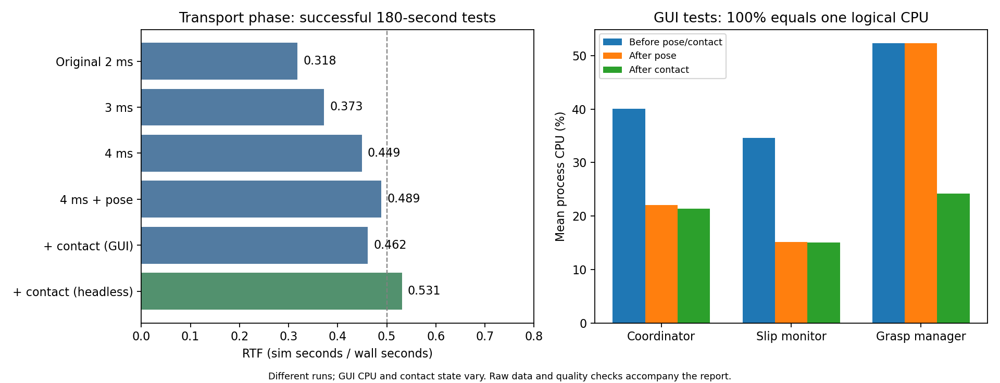
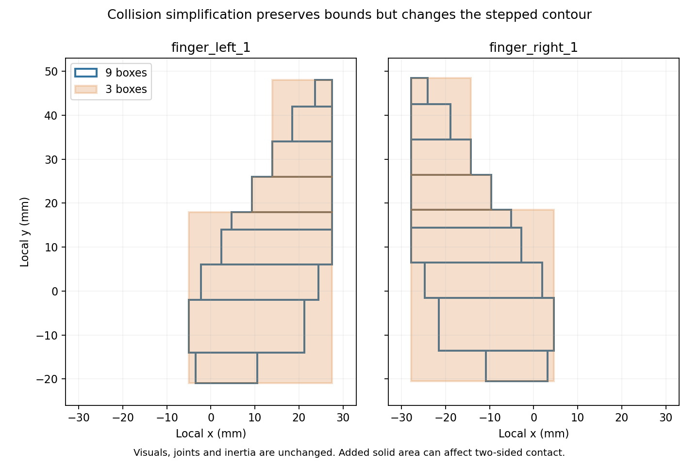

# 協調搬送シミュレーション負荷改善：最終比較

指定手順書に沿って一項目ずつ変更・ビルド・測定し、品質が成立する構成を選択した。失敗した条件の速い RTF は改善値として採用していない。変更前データと失敗ログも保存した。

## 採用設定

| 項目 | 最終設定・判断 |
|---|---|
| 指 collision | 9 box / 指。visual・joint・inertial は維持。経緯は実装記録を参照 |
| physics | max_step_size=0.004 s、real_time_factor=1.0 |
| 姿勢入力 | C++ で amir1 / amir2 / cooperative_payload の 3 モデルへ抽出、位置・姿勢・frame・stamp を保持 |
| 接触通知 | C++ が各セグメントを OR・期限付きで集約し、Python は四つの指 Bool を購読 |
| 把持力 | 四つの F/T 100 Hz と既存の 20 N 目標・制御式を維持 |
| 制御周期 | slip は 50 Hz を維持。30 Hz 試行で CPU 低下を確認できず不採用 |
| 起動 | robot_description の応答、controller active、安全開放/Q_HOME/静止、生成成功を確認して進行 |
| 不要衝突除外 | 危険な pair を除く根拠を確認できず、mask / collision 削除は未適用 |
| GUI | headless=false を既定のまま維持。長時間計測には headless=true を使用できる |

## 180 秒試験：正常な把持後の性能

同じ既定搬送シナリオのうち、支持台除去後から測定終了までを比較する。100% CPU は論理 1 コア相当。GUI CPU・接触状態・測定区間は試行間で変化するため、単発の差をすべて変更の因果効果とは断定しない。

| 条件 | GUI | RTF | Update ms/step | server CPU% | GUI CPU% | coordinator CPU% | slip CPU% | grasp manager CPU% | 最大水平滑り mm |
|---|---|---:|---:|---:|---:|---:|---:|---:|---:|
| A: 元の 2 ms | ON | 0.318 | 5.835 | 120.1 | 84.6 | 34.4 | 30.8 | 51.0 | 0.380 |
| D: 3 ms | ON | 0.373 | 7.570 | 119.3 | 189.6 | 38.2 | 33.5 | 50.8 | 0.300 |
| E: 4 ms | ON | 0.449 | 8.402 | 121.7 | 223.5 | 40.1 | 34.6 | 52.3 | 0.744 |
| F: +姿勢抽出 | ON | 0.489 | 7.636 | 123.3 | 112.9 | 22.1 | 15.1 | 52.3 | 0.236 |
| G3: +接触集約 | ON | 0.462 | 8.113 | 122.4 | 172.1 | 21.4 | 15.0 | 24.2 | 0.444 |
| H2: 接触集約なし | OFF | 0.554 | 6.730 | 124.7 | — | 22.2 | 15.3 | 54.4 | 0.604 |
| G4: 接触集約あり | OFF | 0.531 | 7.044 | 123.8 | — | 22.3 | 15.5 | 26.0 | 0.411 |
| I: slip 30 Hz（不採用） | OFF | 0.525 | 7.121 | 124.2 | — | 22.9 | 15.8 | 26.0 | 0.355 |

接触センサと Gazebo→ROS の 36 raw 接続は維持し、C++ 集約ノードに約 6% CPU が追加される。削減は Python の大型 Contact 変換と callback 数であり、DART 接触計算や ROS raw topic 全体を削減したものではない。

接触集約の headless 最終平均は H2 0.554→G4 0.531 と約 4% 低下した。途中値を終了までの改善値とは扱わない。manager CPU 54.4→26.0% と把持・接触判定の品質を採用根拠とし、単発差の RTF 改善は断定しない。

Update は最終 PreUpdate→最終 Update の主スレッド CPU 時間で、Physics・Sensors・ROS control 等を含む区間。DART 単体時間ではない。4 ms を超える区間が残るため、RTF=1.0 はまだ達成したとはいえない。headless の server は同一 Ruby CLI プロセス内で動くため、GUI 時の子プロセスと識別方法を分けて集計した。



## 既定の全工程と反復検証

0.5 m 前進 → 30°中央軸回転 → 0.3 m 右移動 → 30° A 支点回転。完了後さらに 5 sim 秒保持して停止。初期化を含む RTF と支持台除去後の RTF を分ける。180 秒試験と全工程平均は測定区間が異なる。

| 条件 | 計測 wall 秒 | 最終 sim 秒 | 全区間 RTF | 搬送 RTF | main工程 / A支点回転 | 最大水平 / 垂直滑り mm | 最低 payload 高さ m | fault |
|---|---:|---:|---:|---:|---|---|---:|---|
| J_event_headless_full | 446.0 | 250.7 | 0.565 | 0.496 | 成功 / 成功 | 6.029 / 0.219 | 0.6565 | 観測なし |
| K_full_gui | 570.4 | 320.3 | 0.564 | 0.437 | 成功 / 成功 | 6.019 / 0.188 | 0.6565 | 観測なし |
| K2_full_headless_repeat | 465.2 | 267.0 | 0.576 | 0.495 | 成功 / 成功 | 7.072 / 0.261 | 0.6565 | 観測なし |
| L_retry_3box_full | 147.2 | 127.7 | 比較対象外（未把持） | — | 未成立 / 未成立 | 未把持 | — | ERROR_NO_PHYSICAL_CONTACT |

### 位置・姿勢・接触・力の記録

| 条件 | main 完了時の位置誤差 mm | main 完了時の姿勢誤差 deg | 中央軸の実測角 deg | 接触 false の 1 Hz サンプル数 |
|---|---:|---:|---:|---:|
| J_event_headless_full | — | — | 29.82 | 0/358 |
| K_full_gui | 19.853 | 0.020 | 29.81 | 0/406 |
| K2_full_headless_repeat | 19.853 | 0.126 | 29.82 | 0/361 |
| L_retry_3box_full | — | — | — | 未計測 |

位置・姿勢誤差は main 軌道の完了時を示す。A 支点回転は別ノードへ引き継ぐため、古い main 目標との差を支点回転の追従誤差とは扱わない。J の完了値は 1 Hz サンプルから抽出、以後は完了イベントで記録した。支点回転の成立は既存の目標角 ±1° の停止条件と完了ログで確認する。各台車の位置と quaternion は quality.json / samples.jsonl に保存した。

接触は四指の Bool と 1 Hz の観測結果。力は abs(Fx) の瞬時入力範囲と、支持台除去後の 1 Hz 値の中央値を分ける。短い接触変化を 1 Hz の表だけで否定しない。

| 条件 | 左指 median N (amir1 / amir2) | 右指 median N (amir1 / amir2) | 把持後の瞬時ピーク N |
|---|---:|---:|---:|
| A_baseline | 19.63 / 19.69 | 22.59 / 22.54 | 31.64 |
| J_event_headless_full | 19.69 / 19.66 | 22.60 / 22.58 | 33.28 |
| K_full_gui | 19.58 / 19.75 | 22.46 / 22.69 | 33.37 |
| K2_full_headless_repeat | 19.70 / 19.77 | 22.58 / 22.70 | 35.11 |
| L_retry_3box_full | — / — | — / — | — |

## 不採用・保留と検証限界



外接寸法が同じでも統合 box は段差の隙間を埋める。接触内面の変化が片側接触や力の分布へ影響する可能性があるため、性能だけでは採用しない。これは形状比較からの推定であり、失敗原因をこの図だけで確定したものではない。

- 初期 3box B/B2 は起動・接触確認に失敗。L 再評価では接触が成立したが、四指 20±3 N の安定が 45 sim 秒内に成立せず不採用。把持前 RTF を採用根拠にしない。修正済み起動・接触経路での再試行は全工程表と実装記録に含める。1box は 3box の品質が成立した場合だけ実行する。
- collision filtering は必須衝突を維持できる除外を証明できず未適用。[分類と方式調査](simulation_performance/optimization/collision_classification.md) に根拠を保存した。
- RTF=0.3 の J2 は robot_description 応答喪失で sim=0.408 秒停止。RSP の実際の応答を確認する gate を追加した J3 は把持・支持台除去・保持に成功。データの目標 RTF=0.3 はストレス試験限定で、運用 world は 1.0 に復元した。
- Fast DDS サービス応答の一時喪失が残る。準備確認で安全な順序を保つが、すべての通信失敗や起動時間の差を解消したとはいえない。[起動条件・原因・上流ソース](simulation_performance/optimization/startup_events.md) を参照。
- ROS と生 Gazebo Contacts は contact position のみを持ち、depth / normal / wrench が欠測だった。深さは未知として扱い、0 の貫通を証明したとは記載しない。力は F/T を使用する。
- デスクトップがロックされた状態を確認した。GUI 起動・CPU と機能はログで評価したが、可視画面を目視した検証と描画状態の統一はできていない。shadow / visual 等を未評価のまま変更しない。
- 180 秒の headless 搬送 RTF は 0.531、全工程搬送は約 0.495。最低目標 0.5 は全工程平均でわずかに下回り、目標 0.8 / 1.0 は未達。
- 把持後に LCP/DART の物理負荷が残る。研究品質を犠牲にして RTF=1 を達成したとは報告しない。

## 実行とバックアップ

```bash
cd /home/dars5070/ros2_humble_ws
source /opt/ros/humble/setup.bash
source install/setup.bash
ros2 launch cooperative_transport_bringup integrated_transport_simulation.launch.py headless:=false
```

長時間の計測は headless:=true。比較用に filtered_poses:=false / aggregate_contacts:=false / event_startup:=false を指定できる。finger_collision_boxes:=1/3/9 は実験用で、採用済みの既定値以外の成功を保証する引数ではない。

変更前を e502dd6 と baseline-before-performance-20260928 タグに保存。[GitHub バックアップ](https://github.com/AMIRdars/BACKUP_WS) に変更前と各段階のブランチ、採用構成の main を保存する。build/install/log は .gitignore で除外し、ソース・MD・生測定データを保存する。

測定は simulation_performance/optimization/measure.py、集計は summarize.py、CSV は comparison.csv、全値は results.json と各 quality.json。条件ごとの command、world.sdf、CPU/threads、sim/wall、GPU、Update、ROS node/topic、失敗ログを残した。測定停止時の SIGINT 終了と実行中の機能失敗は区別した。

検証：変更パッケージのビルド、既存 77 テスト、姿勢の値・stamp/frame 一致テスト、接触 OR/解除/失効/欠測深さテスト、safe-open の新しい位置判定テスト、起動 gate の空 description/inactive/閉指/関節移動/clock 欠落の拒否と準備完了テスト。

[実装・判断の時系列記録](負荷改善_実装結果.md) / [変更前の負荷解析](シミュレーション負荷解析結果.md) / [初回定義調査](負荷改善_初回調査.md)

## 次段階の追加検証（2026-09-29）

[Gazebo接触通知の直接集約を検証した結果](負荷改善_次段階結果.md)。接触通知のCPUは約7割減ったが、全工程の搬送RTFは対照0.506に対して候補0.488/0.485となったため、既定への採用を保留。今回の追加後も通常起動は従来のROS入力経路を維持する。候補は `contact_input_transport:=gazebo` で任意に試せる。
