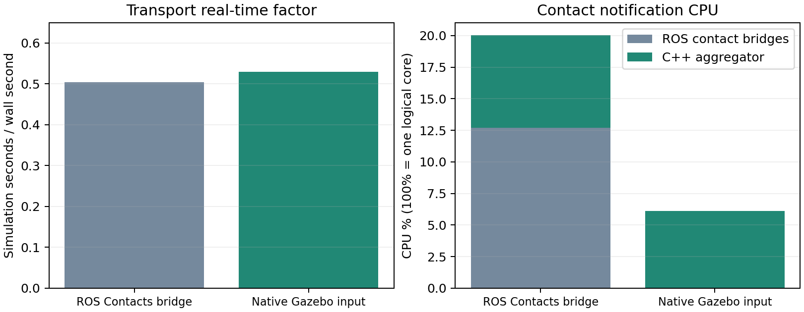

# 負荷改善：次段階の実装・測定結果

手順書の接触通知集約（項目5）を追加検証した。変更前 checkpoint は `5826561`。今回変更した項目は接触情報の入力経路のみ。

## 変更内容

従来：36 Gazebo Contacts → 36 ROS Contacts → C++ 集約 → 四指 Bool。候補：36 Gazebo Contacts → C++ 直接集約 → 四指 Bool。Gazebo の生 Contact topic と36センサは維持し、ROS Contact 変換・配信と二つの finger_contact_bridge プロセスを省く。

9 box/指、物理ステップ4 ms、F/T 100 Hz、集約30 Hz、0.25 sim秒の接触期限、20 N目標と制御式を維持。接触情報のOR・解除・期限・荷物限定・深さ欠測の扱いは両経路で共通。Gazebo callback と ROS timer の共有状態は mutex で保護する。

## 同じ条件の180 wall秒試験（headless）

支持台除去後の平均。CPU 100% は論理1コア相当。

| 条件 | RTF | Update ms/step | server CPU% | contact bridge + 集約 CPU% | manager CPU% | coordinator CPU% | slip CPU% | 最大水平滑り mm |
|---|---:|---:|---:|---:|---:|---:|---:|---:|
| M_ros_contact_baseline | 0.503 | 7.464 | 123.7 | 20.0 | 25.7 | 22.4 | 15.3 | 0.464 |
| N_native_contact_candidate | 0.530 | 7.059 | 124.3 | 6.1 | 26.1 | 22.6 | 15.8 | 0.364 |

この一対の試験ではRTFが 5.2% 向上し、接触通知のCPUは 69.4% 低下。両試験で把持・支持台除去に成功し、faultなし。180秒試験は全工程の完走試験ではない。温度や接触状態の違いもあるため、このRTF差を常に得られる改善率とは断定しない。



Updateは最終PreUpdate→最終Updateの主スレッドCPU時間でPhysics・Sensors・ROS control等を含む。DART単体時間ではない。4 msの時間予算を超える物理負荷が残り、ROS変換の削減を接触拘束計算の削減とは扱わない。

## 全工程の反復

既定の0.5 m前進→30°中央軸回転→0.3 m右移動→30°A支点回転、完了後5 sim秒保持。

| 条件 | wall 秒 | sim 秒 | 全区間RTF | 搬送RTF | main / pivot | 水平 / 垂直滑り mm | 完了位置誤差 mm | 姿勢誤差 deg | fault |
|---|---:|---:|---:|---:|---|---|---:|---:|---|
| K2_full_headless_repeat | 465.2 | 267.0 | 0.576 | 0.495 | True / True | 7.072 / 0.261 | 19.853 | 0.126 | [] |
| O_native_headless_full | 458.9 | 257.2 | 0.563 | 0.488 | True / True | 6.277 / 0.230 | 19.851 | 0.010 | [] |
| P_ros_contact_full_control | 481.4 | 279.9 | 0.584 | 0.506 | True / True | 6.525 / 0.275 | 19.884 | 0.002 | [] |
| Q2_native_headless_full_retry | 466.4 | 260.7 | 0.562 | 0.485 | True / True | 5.385 / 0.199 | 19.627 | 0.031 | [] |

K2は前段階のROS入力構成。Pは今回の同じコードで入力経路をrosにした全工程対照、O/Q2はgazebo入力の反復。180秒試験と区間が異なるため、短い試験との差を全工程の改善率にしない。


| 全工程の搬送区間 | Update ms/step | server CPU% | contact bridge + 集約 CPU% | manager CPU% | coordinator CPU% | slip CPU% |
|---|---:|---:|---:|---:|---:|---:|
| O_native_headless_full | 7.695 | 123.1 | 5.9 | 27.0 | 20.1 | 14.7 |
| P_ros_contact_full_control | 7.422 | 123.5 | 20.1 | 28.6 | 20.5 | 14.6 |
| Q2_native_headless_full_retry | 7.742 | 122.9 | 5.9 | 26.1 | 20.2 | 14.9 |

| 今回の全工程 | 最低payload高さ m | 接触false / 四指同時観測サンプル数（1 Hz） | 支持台除去後の左右F/T中央値 N（amir1 L/R, amir2 L/R） | 把持後瞬時力ピーク N |
|---|---:|---|---|---:|
| O_native_headless_full | 0.6565 | 0/365 | 19.68 / 22.59 / 19.78 / 22.67 | 32.50 |
| P_ros_contact_full_control | 0.6564 | 0/351 | 19.60 / 22.49 / 19.85 / 22.76 | 32.82 |
| Q2_native_headless_full_retry | 0.6565 | 0/369 | 19.56 / 22.45 / 19.67 / 22.58 | 32.82 |

接触表は1 Hz観測で短い変化がないことの証明ではない。F/Tの瞬時入力範囲は quality.json に保存。深さは生Gazebo/ROSで欠測のため未知（null/NaN）とし、貫通ゼロとは記載しない。デスクトップの目視確認を今回のheadless結果から保証しない。

## 起動失敗の記録

Q_native_headless_full_repeat は sim=2.868秒で停止。robot_state_publisher が get_parameters 応答送信のtimeoutを記録し、Gazeboのgz_ros2_controlはrobot_description要求後に進まなくなった。Network is unreachableも記録された。手動停止時点のインターフェースは接続状態で、障害との因果を確定していない。前段階でも同種のサービス応答喪失が記録されている。失敗を性能値にせずログ・条件を保存し、同じ条件のQ2で再試行した。今回は通信設定や起動ロジックを追加変更していない。

性能表はcondition.jsonに記録した測定時点のコード。最終レビューでは時刻を共有状態のmutex取得後に読むよう変更し、直後に新旧接続テストを再実行した。この読み取り順序修正後の全工程性能は再測定していないため、改善率を追加で主張せず、候補の採用保留を維持する。

## 判定と利用方法

**判定：保留（既定設定は従来のROS入力を維持）。** 接触通知のCPU削減は成立したが、候補の全工程搬送RTFは0.488/0.485、対照は0.506で、平均すると約3.8%低下した。手順書のRTF悪化時の差し戻し条件に従い、直接入力を既定として採用しない。

候補2回と対照1回で全工程の把持・搬送・支点回転・保持は成功、faultなし。最大滑りは候補6.277/5.385 mm、対照6.525 mmで、この観測範囲では増大していない。ただしRTF=0.5/0.8/1.0の目標をこの候補で達成したとは扱わない。任意の実験引数として残し、通常の実行コマンドの挙動を維持する。

```bash
cd /home/dars5070/ros2_humble_ws
source /opt/ros/humble/setup.bash
source install/setup.bash
ros2 launch cooperative_transport_bringup integrated_transport_simulation.launch.py headless:=false
```

`contact_input_transport:=ros` で前段階の生ROS Contact→集約経路へ戻せる。`aggregate_contacts:=false` では従来の生ROS Contact経路を維持する。直接入力構成では36本の生ROS segment topicは配信しないが、生Gazebo topicは維持する。Gazebo構造上のtopic名は `world_name` / `robot_names` / 左右指 / センサ連番から構成する。

直接入力候補を任意で試すコマンド（既定への採用とは別）：

```bash
ros2 launch cooperative_transport_bringup integrated_transport_simulation.launch.py headless:=true contact_input_transport:=gazebo
```

## 検証・保存

対象3パッケージのビルド、launch引数とPython構文確認、既存ROS接触経路の回帰テスト、新Gazebo経路のOR/解除/失効/荷物以外除外/深さ欠測・実値/逆collision順の接続テストを実施。Gazebo注入テストは独立 IGN_PARTITION と ROS_DOMAIN_ID を使用する。

[測定・ソース・再現方法](simulation_performance/next_stage/README.md) / [前段階の結果](負荷改善_最終比較.md) / [GitHubバックアップ](https://github.com/AMIRdars/BACKUP_WS)

変更前は `baseline-before-native-contact-20260929`、実験履歴は `perf/contact-native-transport` に保存。生計測ログと条件・比較CSVを残す。採用設定のRTF=0.8/1.0達成や、通信喪失を含めた全条件の起動保証はしない。
